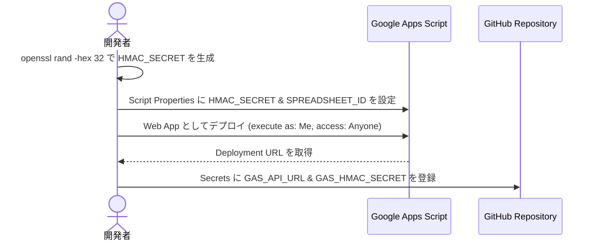
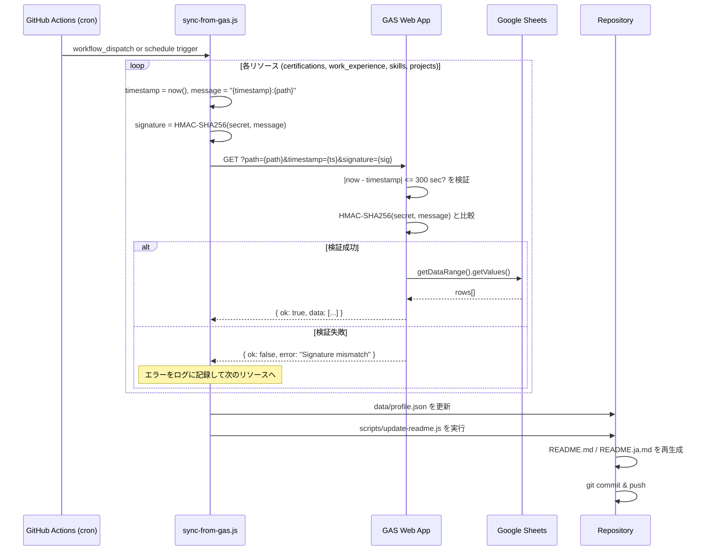
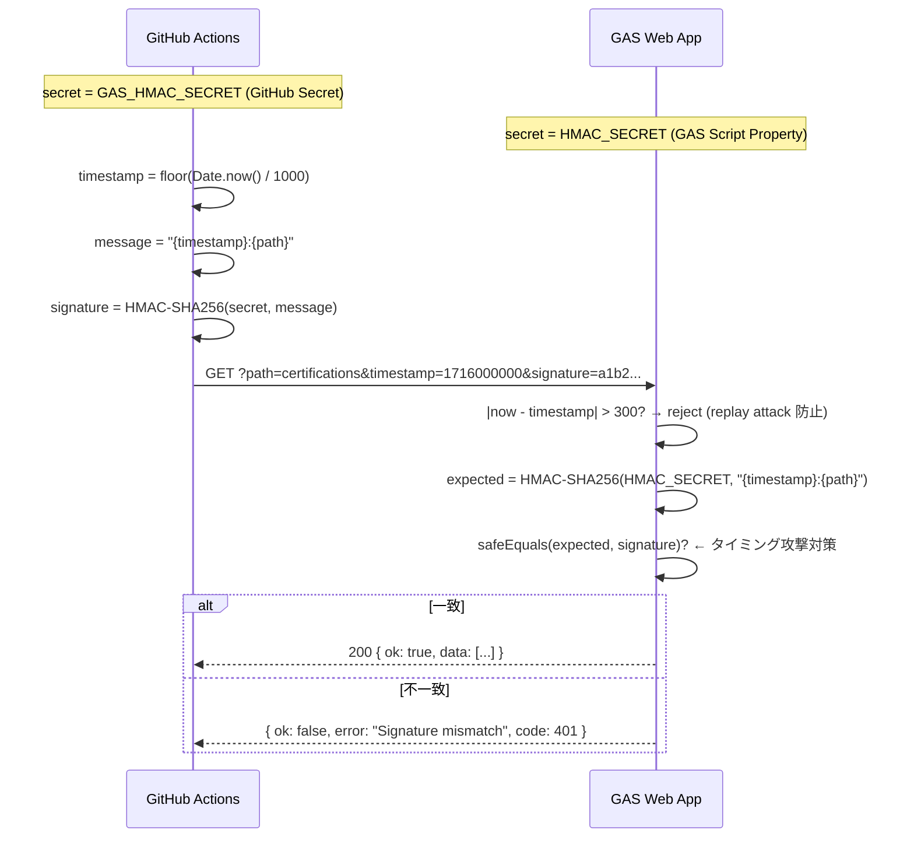

# Profile API — シーケンス図

GitHub Pages で閲覧する場合、Mermaid は GitHub Markdown エンジンで自動レンダリングされます。

---

## 1. 初期セットアップ（初回のみ）



---

## 2. 定期同期フロー（毎日 05:00 JST）



---

## 3. HMAC-SHA256 署名の仕組み



---

## 4. ローカルでの動作確認

```bash
# .env に設定
GAS_API_URL=https://script.google.com/macros/s/YOUR_ID/exec
GAS_HMAC_SECRET=your_secret_here

# 署名を生成して URL を確認
node scripts/generate-hmac.js certifications

# profile.json を手動同期
node scripts/sync-from-gas.js
```
