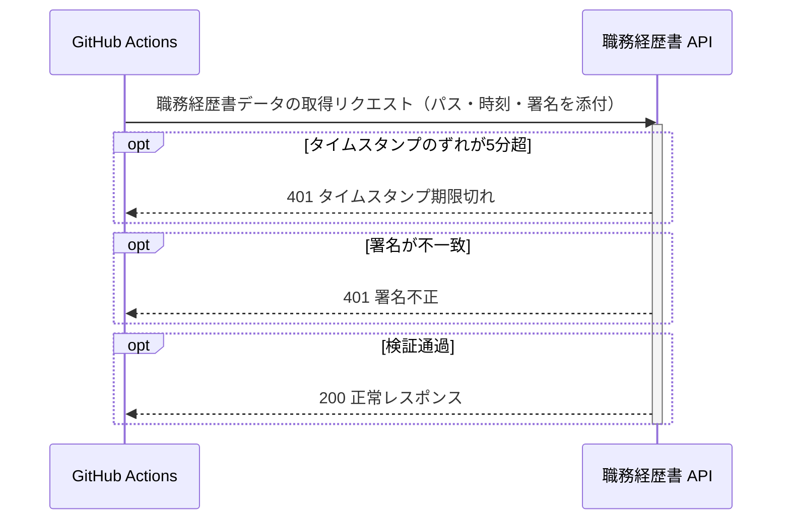

# 認証フロー

リクエストごとに署名を生成・検証することで、正規のクライアントだけがデータを取得できる仕組みです。
タイムスタンプを署名に含めることで、過去のリクエストを再利用する攻撃も防ぎます。

## API仕様書

[認証API](https://ageha734.github.io/ageha734/)

## シーケンス図

```mermaid
sequenceDiagram
    participant client as GitHub Actions
    participant api as 職務経歴書 API

    client ->> api: 職務経歴書データの取得リクエスト（パス・時刻・署名を添付）
    activate api

    opt タイムスタンプのずれが5分超
        api -->> client: 401 タイムスタンプ期限切れ
    end

    opt 署名が不一致
        api -->> client: 401 署名不正
    end

    opt 検証通過
        api -->> client: 200 正常レスポンス
    end
    deactivate api
```


