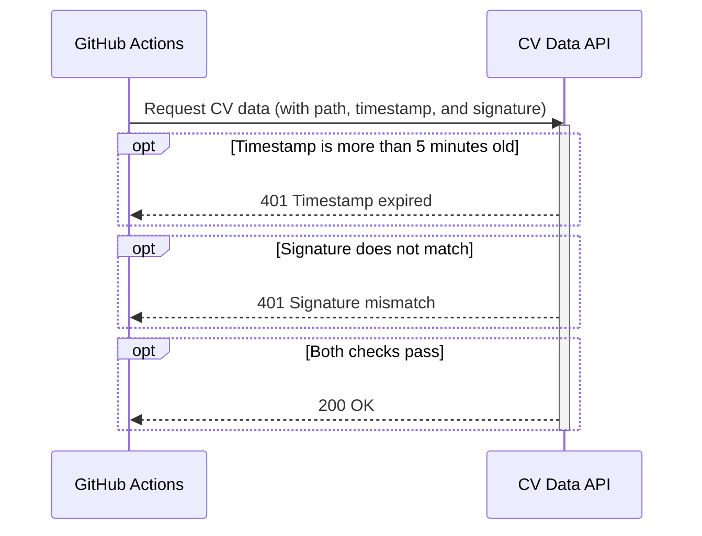

  <a href="../../index.md">← Back to index</a>
  ｜ <a href="../ja/auth.md">日本語</a> ｜ English

Each request is signed and verified so that only authorized clients can retrieve data.
By including a timestamp in the signature, the system also prevents replay attacks.

## API specifications

[Auth API](https://ageha734.github.io/ageha734/)

## Sequence diagram


