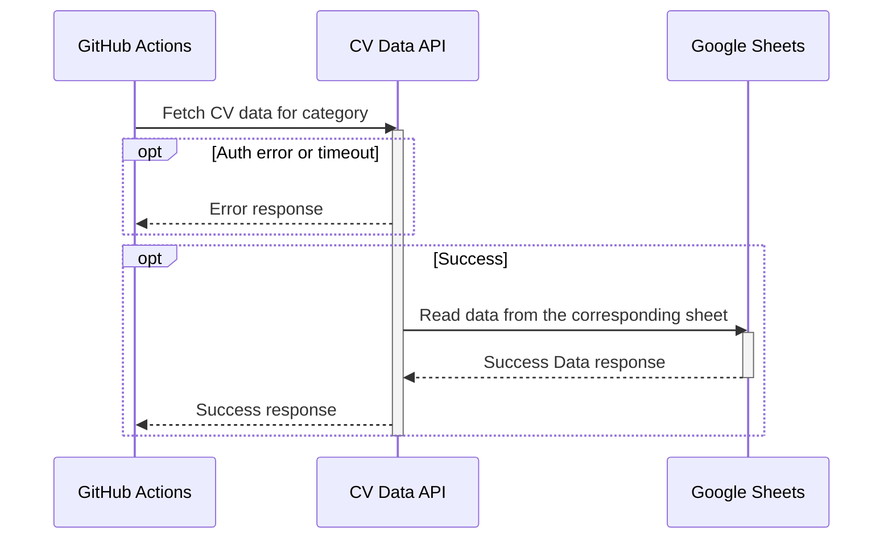

  <a href="../../index.md">← Back to index</a>
  ｜ <a href="../ja/sync.md">日本語</a> ｜ English

## API specifications

[CV Data API](https://ageha734.github.io/ageha734/)

## Sequence diagram

```mermaid
sequenceDiagram
    participant user as GitHub Actions
    participant api as CV Data API
    participant sheet as Google Sheets

    user ->> api: Fetch CV data for category
    activate api

    opt Auth error or timeout
        api -->> user: Error response
    end

    opt Success
        api ->> sheet: Read data from the corresponding sheet
        activate sheet
        sheet -->> api: Success Data response
        deactivate sheet
        api -->> user: Success response
    end

    deactivate api
```


