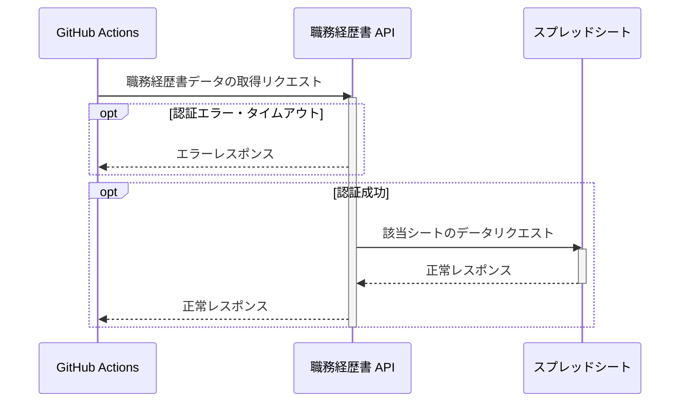

# 職務経歴書データ取得フロー

## API仕様書

[職務経歴書データの取得API](https://ageha734.github.io/ageha734/)

## シーケンス図

```mermaid
sequenceDiagram
    participant user as GitHub Actions
    participant api as 職務経歴書 API
    participant sheet as スプレッドシート

    user ->> api: 職務経歴書データの取得リクエスト
    activate api

    opt 認証エラー・タイムアウト
        api -->> user: エラーレスポンス
    end

    opt 認証成功
        api ->> sheet: 該当シートのデータリクエスト
        activate sheet
        sheet -->> api: 正常レスポンス
        deactivate sheet
        api -->> user: 正常レスポンス
    end

    deactivate api
```


