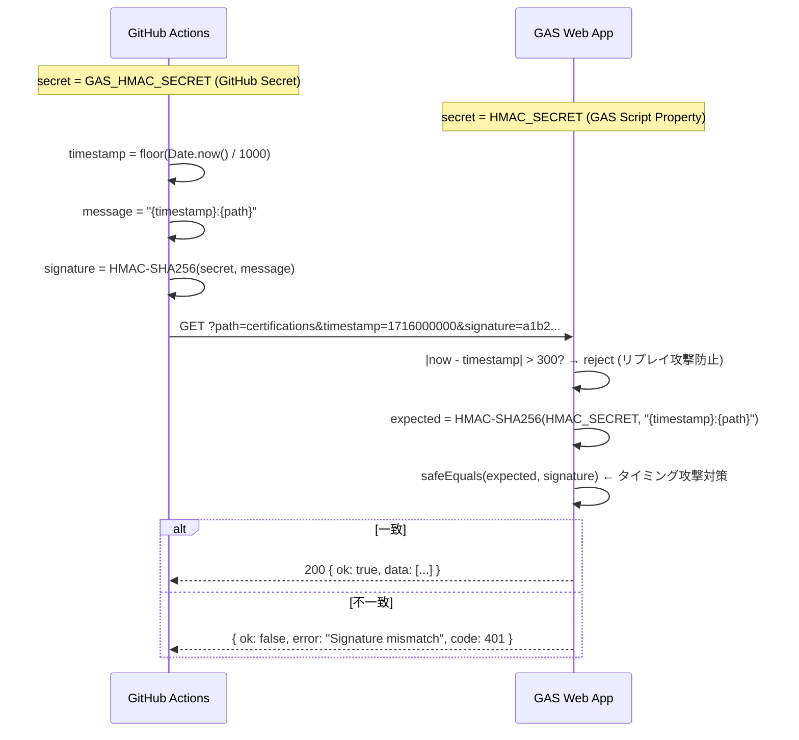

# HMAC-SHA256 認証フロー

リクエストごとに署名を生成・検証する仕組み。リプレイ攻撃をタイムスタンプで防止する。

```mermaid
sequenceDiagram
    participant Client as GitHub Actions
    participant Server as GAS Web App

    Note over Client: secret = GAS_HMAC_SECRET (GitHub Secret)
    Note over Server: secret = HMAC_SECRET (GAS Script Property)

    Client->>Client: timestamp = floor(Date.now() / 1000)
    Client->>Client: message = "{timestamp}:{path}"
    Client->>Client: signature = HMAC-SHA256(secret, message)
    Client->>Server: GET ?path=certifications&timestamp=1716000000&signature=a1b2...

    Server->>Server: |now - timestamp| > 300? → reject (リプレイ攻撃防止)
    Server->>Server: expected = HMAC-SHA256(HMAC_SECRET, "{timestamp}:{path}")
    Server->>Server: safeEquals(expected, signature)  ← タイミング攻撃対策
    alt 一致
        Server-->>Client: 200 { ok: true, data: [...] }
    else 不一致
        Server-->>Client: { ok: false, error: "Signature mismatch", code: 401 }
    end
```
