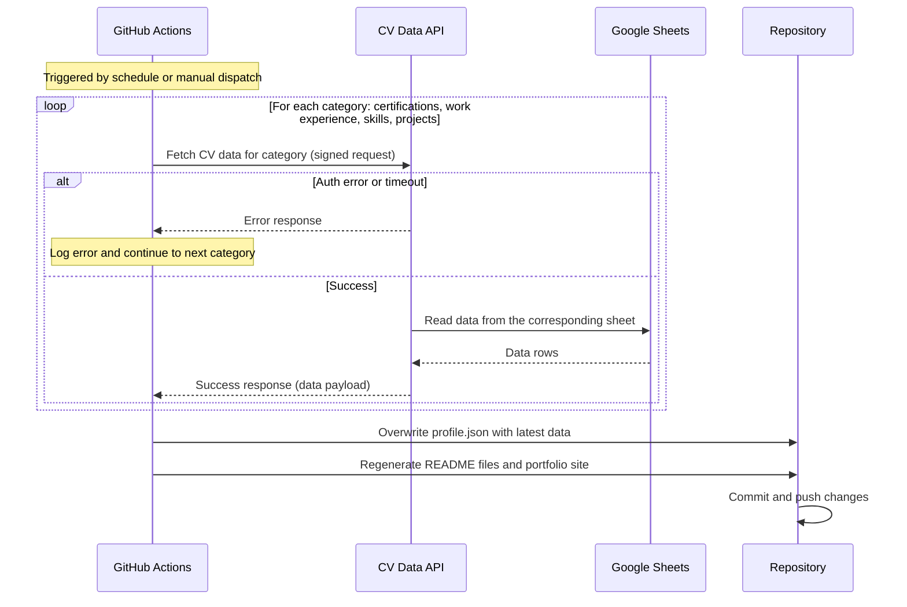

# Periodic Sync Flow

GitHub Actions runs automatically every day at 05:00 JST to pull the latest data from Google Sheets and keep the repository up to date.

## How It Works

1. **GitHub Actions** starts the sync process on a schedule or when triggered manually.
2. It fetches data for each CV category (certifications, work experience, skills, projects) one at a time.
3. Once all data is collected, it updates `profile.json`, regenerates the README files and portfolio site, and commits the changes to the repository.

