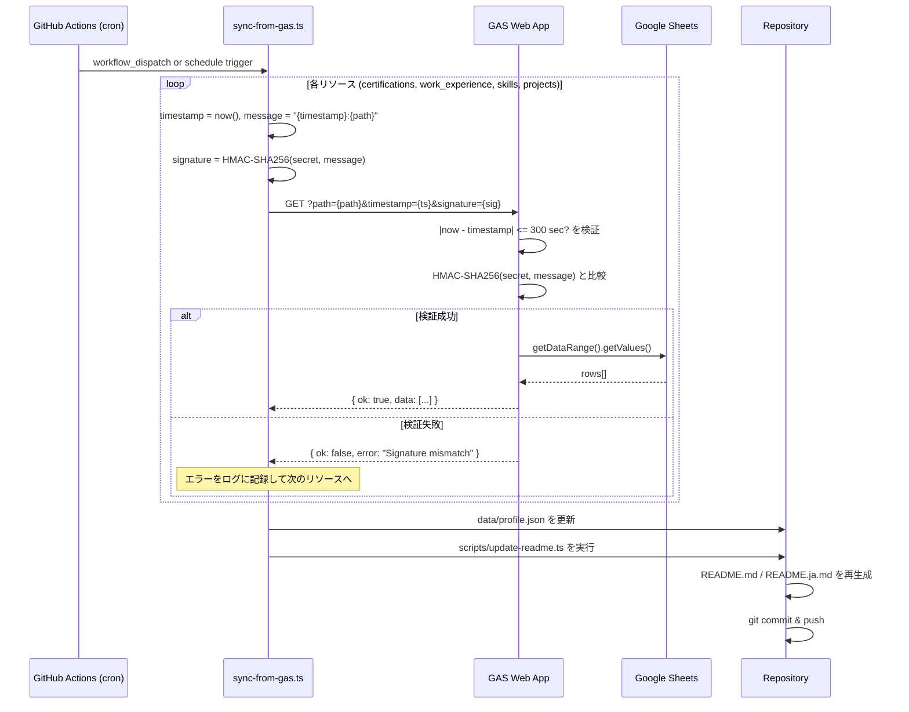

# 定期同期フロー

毎日 05:00 JST に GitHub Actions が自動実行する同期フロー。

```mermaid
sequenceDiagram
    participant Cron as GitHub Actions (cron)
    participant Node as sync-from-gas.ts
    participant GAS as GAS Web App
    participant Sheet as Google Sheets
    participant Repo as Repository

    Cron->>Node: workflow_dispatch or schedule trigger
    loop 各リソース (certifications, work_experience, skills, projects)
        Node->>Node: timestamp = now(), message = "{timestamp}:{path}"
        Node->>Node: signature = HMAC-SHA256(secret, message)
        Node->>GAS: GET ?path={path}&timestamp={ts}&signature={sig}
        GAS->>GAS: |now - timestamp| <= 300 sec? を検証
        GAS->>GAS: HMAC-SHA256(secret, message) と比較
        alt 検証成功
            GAS->>Sheet: getDataRange().getValues()
            Sheet-->>GAS: rows[]
            GAS-->>Node: { ok: true, data: [...] }
        else 検証失敗
            GAS-->>Node: { ok: false, error: "Signature mismatch" }
            Note over Node: エラーをログに記録して次のリソースへ
        end
    end
    Node->>Repo: data/profile.json を更新
    Node->>Repo: scripts/update-readme.ts を実行
    Repo->>Repo: README.md / README.ja.md を再生成
    Repo->>Repo: git commit & push
```
