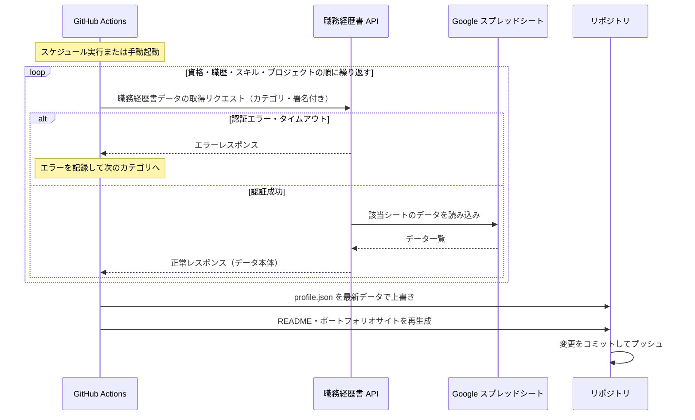

# 定期同期フロー

毎日 05:00 JST に GitHub Actions が自動実行し、Google スプレッドシートの最新データをリポジトリに反映します。

## 仕組みの概要

1. **GitHub Actions** がスケジュールまたは手動操作をトリガーとして同期処理を開始します。
2. 職務経歴書の各カテゴリ（資格・職歴・スキル・プロジェクト）について、順番にデータを取得します。
3. 取得したデータをもとに `profile.json` を更新し、README とポートフォリオサイトを再生成してリポジトリにコミットします。

